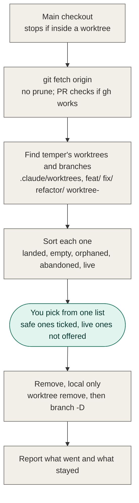

# `/temper:cleanup` Implementation Plan

> **For agentic workers:** REQUIRED SUB-SKILL: Use superpowers:subagent-driven-development (recommended) or superpowers:executing-plans to implement this plan task-by-task. Steps use checkbox (`- [ ]`) syntax for tracking.

## Handing back to temper

This plan runs inside a temper run. When every task is complete and the final
whole-branch review is clean, end with your list of rulings and hand control back
to `/temper:feature`, which checks the branch and opens the pull request. temper's
finish takes the place of `superpowers:finishing-a-development-branch` here.

**Goal:** A `/temper:cleanup` command that lists temper's worktrees and branches in the working project, sorts each by state, asks once, and removes the chosen ones locally, never touching the remote.

**Architecture:** temper is a Claude Code plugin made of markdown: commands under `commands/` that an agent follows step by step, and skills under `skills/`. This adds one command file, `commands/cleanup.md`, with no new skill. It is tested end to end by building a throwaway git repo with a bare local "origin" and one fixture per state, following the command there, and checking git's state afterwards with a script.

**Tech Stack:** Markdown (Claude Code plugin command), git, `gh` (optional at run time), bash for the test harness.

**Spec:** `.scratch/cleanup-command/spec.md`

## Global Constraints

- Before editing any file, declare it: `gatebolt declare --task "<one line>" --vendor claude_code --name "Claude Code" --model <model id> --file <path> ...`. The repo runs GateBolt strict mode; undeclared edits are blocked.
- Gate: `claude plugin validate .` must pass after every task.
- Commits: subject line only, with no body and no trailer (not even Co-Authored-By); lowercase, at most 80 characters, saying what changed; one logical change per commit, and each commit passes its gates.
- The command acts only on the repo it's run in, and only locally. It never runs `git push`, `git push --delete`, `git fetch --prune`, `git remote prune`, `gh pr close`, or anything else that changes the remote or its tracking refs. Its one remote call is a plain `git fetch origin`.
- Candidates are only worktrees under `.claude/worktrees/` and local branches named `feat/*`, `fix/*`, `refactor/*` or `worktree-*`. Nothing else is listed or touched.
- It never uses `git worktree remove --force`.
- Command files follow the house style of `commands/review.md` and `commands/bug.md`: YAML frontmatter with `description`, a `# temper <name>` title, numbered `## N.` steps, each ending in a `Done when …` line. The voice is plain and short.
- This session is isolated to its worktree and refuses compound shell commands that run git elsewhere (pipelines, `&&` chains, `bash <script>`). If it refuses to run `fixture.sh` or `check.sh` as a script, run the script's commands one plain command at a time, with absolute paths and `git -C <dir>`. The fixture goes under the session's scratchpad directory, not the worktree.
- The test harness lives in `.scratch/cleanup-command/test/`. `temper:finish` deletes `.scratch/` before the PR, so the harness is a build-time check only.

## Review Focus

1. **A temper branch checked out in the main checkout** (the user ran cleanup while on `feat/x`). `git branch -D` would fail on it; it must show as Live with the reason "checked out in the main checkout". This is pinned in Task 1, Step 7.
2. **The fetch fails** (offline, or a bad remote URL). The run must say so and carry on against the last fetched state, not stop. This is pinned in Task 1, Step 7.
3. **A worktree with a detached HEAD** under `.claude/worktrees/`. It has no branch to delete; removal is the worktree only, and any commits it holds that exist nowhere else make it Live. This is pinned by the `detached` fixture.
4. **A second run straight after a cleanup**, where only Live items remain. It must show the table and stop without asking. This is pinned in Task 1, Step 7.
5. **Running from inside a worktree.** It must stop before fetching or changing anything. This is pinned in Task 1, Step 6.

---

### Task 1: The cleanup command, proven against a fixture repo

**Files:**
- Create: `.scratch/cleanup-command/test/fixture.sh`
- Create: `.scratch/cleanup-command/test/check.sh`
- Create: `commands/cleanup.md`

**Interfaces:**
- Consumes: the `start` skill's definition of the default branch (`gh repo view --json defaultBranchRef -q .defaultBranchRef.name`, or `main` if that fails).
- Produces: the command `/temper:cleanup` (file `commands/cleanup.md`), which Task 2's README text refers to by that name.

- [ ] **Step 1: Write the fixture builder**

Create `.scratch/cleanup-command/test/fixture.sh`:

```bash
#!/usr/bin/env bash
# Builds a throwaway project with a bare local origin and one temper
# worktree or branch per cleanup state. Usage: fixture.sh <new dir>
set -euo pipefail
T="${1:?usage: fixture.sh <new dir>}"
mkdir -p "$T"
cd "$T"
git init -q --bare -b main origin.git
git clone -q origin.git proj 2>/dev/null
cd proj
git config user.email fixture@example.com
git config user.name fixture
printf '.claude/worktrees/\n' > .gitignore
echo base > README
git add .
git commit -qm base
git push -q origin main
W=.claude/worktrees

# landed: fast-forward merged into main and pushed
git worktree add -q -b feat/landed "$W/landed"
echo a > "$W/landed/a"
git -C "$W/landed" add a
git -C "$W/landed" commit -qm landed
git merge -q --ff-only feat/landed
git push -q origin main

# squashed: branch pushed, squash-merged into main; only a PR proves it landed
git worktree add -q -b fix/squashed "$W/squashed"
echo s > "$W/squashed/s"
git -C "$W/squashed" add s
git -C "$W/squashed" commit -qm squashed
git -C "$W/squashed" push -q origin fix/squashed
git merge -q --squash fix/squashed
git commit -qm "squash fix/squashed"
git push -q origin main

# empty: a run that ended in the grill
git worktree add -q -b feat/empty "$W/empty"

# dirty: an uncommitted file
git worktree add -q -b feat/dirty "$W/dirty"
echo d > "$W/dirty/d"

# unpushed: a commit that exists nowhere else
git worktree add -q -b refactor/unpushed "$W/unpushed"
echo u > "$W/unpushed/u"
git -C "$W/unpushed" add u
git -C "$W/unpushed" commit -qm unpushed

# locked: maybe in use by another session
git worktree add -q -b feat/locked "$W/locked"
git worktree lock "$W/locked"

# gone: folder deleted by hand, git still tracks it
git worktree add -q -b feat/gone "$W/gone"
rm -rf "$W/gone"

# detached: a worktree with no branch, at main
git worktree add -q --detach "$W/detached"

# stray: a branch whose rename never happened, no worktree
git branch worktree-stray

# not temper's: must never be listed or touched
git switch -q -c scratch/foo
echo f > f
git add f
git commit -qm foo
git switch -q main

git -C "$T/origin.git" for-each-ref --format='%(refname) %(objectname)' > "$T/remote-before.txt"
echo "fixture ready: $T/proj"
```

Run: `chmod +x .scratch/cleanup-command/test/fixture.sh`

- [ ] **Step 2: Write the check**

Create `.scratch/cleanup-command/test/check.sh`:

```bash
#!/usr/bin/env bash
# Checks the fixture project after /temper:cleanup ran with the preselected
# choice. Usage: check.sh <fixture dir>
set -uo pipefail
T="${1:?usage: check.sh <fixture dir>}"
P="$T/proj"
fail=0

want="feat/dirty feat/locked fix/squashed main refactor/unpushed scratch/foo"
got=$(git -C "$P" branch --format='%(refname:short)' | sort | tr '\n' ' ' | sed 's/ $//')
[ "$got" = "$want" ] || { echo "FAIL branches: want [$want] got [$got]"; fail=1; }

want="dirty locked squashed unpushed"
got=$(git -C "$P" worktree list --porcelain | awk '/^worktree /{print $2}' \
  | grep '/.claude/worktrees/' | xargs -n1 basename | sort | tr '\n' ' ' | sed 's/ $//')
[ "$got" = "$want" ] || { echo "FAIL worktrees: want [$want] got [$got]"; fail=1; }

if git -C "$P" worktree list --porcelain | grep -q '^prunable'; then
  echo "FAIL a prunable worktree record is left"; fail=1
fi

[ -f "$P/.claude/worktrees/dirty/d" ] || { echo "FAIL the dirty worktree's file is gone"; fail=1; }

git -C "$T/origin.git" for-each-ref --format='%(refname) %(objectname)' \
  | diff -q - "$T/remote-before.txt" >/dev/null \
  || { echo "FAIL the remote changed"; fail=1; }

[ "$fail" = 0 ] && echo "PASS"
exit "$fail"
```

Run: `chmod +x .scratch/cleanup-command/test/check.sh`

- [ ] **Step 3: Build a fixture and watch the check fail**

Run:
```bash
F=$(mktemp -d)/fx
.scratch/cleanup-command/test/fixture.sh "$F"
.scratch/cleanup-command/test/check.sh "$F"
```
Expected: `FAIL branches: …` and `FAIL worktrees: …` (nothing has been cleaned yet), and a non-zero exit. The remote check passes.

- [ ] **Step 4: Write the command**

Create `commands/cleanup.md`:

````markdown
---
description: "Remove the worktrees and branches temper runs leave behind in this project once their work has landed. Local only: nothing on the remote is touched."
---

# temper cleanup

Clears up after temper runs in the project you're working in: the worktrees under
`.claude/worktrees/` and the branches behind them. It shows everything first, asks
once, and removes only what the user picks.

Everything happens in this checkout's own git. Nothing on the remote is deleted,
pushed or changed: never `git push`, `git fetch --prune`, `git remote prune` or
`gh pr close`. Remote branches are the user's to manage.

The default branch is as the `start` skill defines it.

## 1. Where you are

`git rev-parse --git-dir` and `git rev-parse --git-common-dir` resolve to the same
path in the main checkout. If they differ, you're inside a worktree: stop, and tell
the user to run this from the project's main checkout, since git can't remove the
worktree a session is standing in.

Any branch, a dirty tree and a missing `.claude/temper.md` are all fine. This
command never commits.

Done when you're in the main checkout.

## 2. Bring origin up to date

`git fetch origin`, with no `--prune`, so "landed" is judged against the default
branch as it is on the remote now. If the fetch fails, say so and carry on against
the last fetched state.

Then check whether pull request checks can run: `gh auth status` succeeds and
`gh pr list --limit 1` works in this repo. If either fails, PR checks are off for
this run. Say so; step 4 then treats anything that needs a PR to decide as Live.

Done when the fetch has run or failed, and you know whether PR checks are on.

## 3. Find the candidates

From `git worktree list --porcelain` and
`git branch --list --format='%(refname:short)'`, take:

- every worktree whose path is under this checkout's `.claude/worktrees/`
- every local branch named `feat/*`, `fix/*`, `refactor/*` or `worktree-*`

A worktree and the branch it has checked out are one item. A branch with no
worktree is an item of its own, and so is a worktree with a detached HEAD. The main
checkout, the default branch and every other branch are never candidates, and are
never shown.

If there are none, say the project has nothing to clean up, and stop.

Done when you have the list of items.

## 4. Sort each item

Below, the tip is the item's branch, or `HEAD` in its worktree when it has no
branch. Check the states in this order; the first that matches is the item's
state. Record the reason in a few words.

1. **Live**: kept, never offered. Any of:
   - the worktree is marked `locked`
   - the worktree's folder exists and `git -C <path> status --porcelain` prints
     anything
   - the branch is checked out in the main checkout
   - `git rev-list <tip> --not --remotes=origin` prints anything: commits that
     exist nowhere else, even when the PR merged
   - PR checks are on and `gh pr list --head <branch> --state open` finds one
2. **Orphaned**: the worktree is marked `prunable`, meaning its folder is gone.
3. **Landed**: PR checks are on and `gh pr list --head <branch> --state merged`
   finds one; or PR checks are off and
   `git merge-base --is-ancestor <tip> origin/<default branch>` succeeds.
4. **Abandoned**: PR checks are on and `gh pr list --head <branch> --state closed`
   finds one that didn't merge.
5. **Empty**: `git merge-base --is-ancestor <tip> origin/<default branch>`
   succeeds, so it holds nothing that isn't already on the default branch.
6. **Live**, for everything left: commits of its own with no PR or, with PR checks
   off, a PR state that couldn't be checked.

Done when every item has a state and a reason.

## 5. Ask once

Show one table of every item: worktree path (or `—`), branch (or `detached`),
state and reason. Order it Landed, Empty, Orphaned, Abandoned, then Live.

If no item is Landed, Empty, Orphaned or Abandoned, say there's nothing safe to
remove and stop without asking.

Otherwise ask one multi-select question listing only those items. Landed, Empty
and Orphaned are selected; Abandoned is offered unselected. Live items are in the
table but aren't options. Picking nothing removes nothing.

Done when the user has answered.

## 6. Remove

For each picked item, in order, skipping the rest of that item's steps as soon as
one fails:

1. `git worktree remove <path>` when it has a worktree, including one whose
   folder is gone, since that clears git's record of it. Never `--force`: git's
   own check on a dirty worktree always applies.
2. `git branch -D <branch>` when it has a branch. `-D` because `-d` refuses
   squash-merged branches; step 4 has already made sure nothing is lost. git
   refuses to delete a branch still registered to a worktree, which is why the
   worktree goes first.

Don't run `git worktree prune`: it would also clear orphaned worktrees the user
didn't pick.

A failure is reported with git's message and never retried with force.

Done when every picked item is removed or has a reported failure.

## 7. Report

What was removed; then what was left, with its state and reason; then anything that
failed or couldn't be checked, including a fetch that failed or PR checks that were
off.

Done when the report is in front of the user.
````

- [ ] **Step 5: Follow the command against the fixture and check it**

In the fixture's main checkout (`$F/proj`), follow `commands/cleanup.md` from step 1 to step 7 exactly as written, with every git and gh command run with `git -C "$F/proj"` or from that directory. At the question in step 5, take the preselected choice. The fixture has no GitHub remote, so PR checks are off.

Expected table (the order within a state doesn't matter):

| worktree | branch | state |
|---|---|---|
| `landed` | `feat/landed` | Landed |
| `empty` | `feat/empty` | Landed |
| `detached` | detached | Landed |
| — | `worktree-stray` | Landed |
| `gone` | `feat/gone` | Orphaned |
| `squashed` | `fix/squashed` | Live (PR state couldn't be checked) |
| `dirty` | `feat/dirty` | Live (uncommitted changes) |
| `unpushed` | `refactor/unpushed` | Live (commits that exist nowhere else) |
| `locked` | `feat/locked` | Live (locked) |

`scratch/foo` and `main` must not appear.

Then run: `.scratch/cleanup-command/test/check.sh "$F"`
Expected: `PASS`

If the table or the check disagrees, fix `commands/cleanup.md`, build a fresh fixture (Step 3), and repeat this step.

- [ ] **Step 6: Check it stops inside a worktree**

Build a fresh fixture `F2`. From `$F2/proj/.claude/worktrees/squashed`, follow step 1 of the command.
Expected: it stops and tells the user to run from the main checkout. Then:
```bash
git -C "$F2/origin.git" for-each-ref --format='%(refname) %(objectname)' | diff - "$F2/remote-before.txt" && echo remote-unchanged
git -C "$F2/proj" branch --format='%(refname:short)' | wc -l
```
Expected: `remote-unchanged`, and 10 branches, which is every fixture branch still there.

- [ ] **Step 7: Check the Review Focus cases**

Using `$F` from Step 5 (already cleaned):

1. Second run: follow the command again in `$F/proj`. Expected: a table of the four Live items, the message that there's nothing safe to remove, no question, and nothing removed. `check.sh "$F"` still prints `PASS`.
2. Branch checked out in the main checkout: `git -C "$F/proj" switch -q -c feat/here`, then follow the command. Expected: `feat/here` is Live with the reason "checked out in the main checkout", with no question asked, since there's nothing safe to remove. Then `git -C "$F/proj" switch -q main && git -C "$F/proj" branch -D feat/here`.
3. The fetch fails: `git -C "$F/proj" remote set-url origin /nonexistent`, then follow the command. Expected: it reports the fetch failed, carries on, and shows the same table as case 1. Then `git -C "$F/proj" remote set-url origin "$F/origin.git"`.

- [ ] **Step 8: Run the gate**

Run: `claude plugin validate .`
Expected: validation passes.

- [ ] **Step 9: Commit**

```bash
git add commands/cleanup.md .scratch/cleanup-command/test/fixture.sh .scratch/cleanup-command/test/check.sh
git commit -m "add /temper:cleanup to remove landed worktrees and branches, local only"
```

---

### Task 2: Point the README at the command and bump the version

**Files:**
- Modify: `README.md` (sections named below)
- Modify: `.claude-plugin/plugin.json` (`"version"`)

**Interfaces:**
- Consumes: the command name `/temper:cleanup` from Task 1, and its behaviour as `commands/cleanup.md` describes it.
- Produces: nothing later tasks use.

- [ ] **Step 1: Check the old manual steps are there**

Run: `grep -n "remove it yourself\|git worktree remove\|until you remove it\|except \`/review\`\|review.md$" README.md`
Expected: matches in "After the pull request", the uninstall step "Runs that didn't finish", the "Where things live" table, "The shared ending", and the Files tree. These are the lines this task changes.

- [ ] **Step 2: "How to use it"**

Replace:
```markdown
**Start every command from the repo's main checkout, on `main`, with a clean
tree** — except `/temper:review`, which runs inside the worktree it's reviewing.
temper creates the worktree and the branch itself.
```
with:
```markdown
**Start every command from the repo's main checkout, on `main`, with a clean
tree** — except `/temper:review`, which runs inside the worktree it's reviewing,
and `/temper:cleanup`, which runs from the main checkout on any branch.
temper creates the worktree and the branch itself.
```

- [ ] **Step 3: Add a "Clean up after runs" section**

Directly after the "Review work that already exists" section, and before "### The start line", insert:

````markdown
### Clean up after runs

From the main checkout:

```
/temper:cleanup
```

It lists every worktree under `.claude/worktrees/` and every local `feat/`, `fix/`,
`refactor/` or `worktree-` branch, and sorts each one: **landed** (its PR merged,
or it's already in `main`), **empty**, **orphaned** (its folder is gone),
**abandoned** (its PR closed without merging), or **live**. Live means an open
PR, uncommitted changes, commits that exist nowhere else, a locked worktree, or
something it couldn't check. It asks once, with the safe ones already ticked and
live ones not offered, and removes only what you pick.

It works locally only. Remote branches are never deleted or changed. Without `gh`
signed in it still runs, but anything that needs a PR to decide counts as live.
Picking nothing removes nothing, so running it is also a way to look.
````

- [ ] **Step 4: "After the pull request"**

Replace:
```markdown
temper never merges. The worktree stays for PR feedback; remove it yourself once
the work lands.
```
with:
```markdown
temper never merges. The worktree stays for PR feedback; once the work lands,
`/temper:cleanup` removes it and its branch.
```

- [ ] **Step 5: The uninstall step "Runs that didn't finish"**

Replace:
```markdown
- **Runs that didn't finish** — `git worktree list` shows any left under
  `.claude/worktrees/`, each on a `feat/`, `fix/` or `refactor/` branch holding its
  `.scratch/` folder. Once you've saved anything you want from one, remove it with
  `git worktree remove .claude/worktrees/<slug>`, then delete its branch.
```
with:
```markdown
- **Worktrees and branches runs left behind** — run `/temper:cleanup` before
  uninstalling. It removes the ones whose work landed or never started, and lists
  the ones still holding work, so you can save what you want and remove them
  yourself.
```

- [ ] **Step 6: Workflows diagram**

After the `/temper:review` diagram and before "### Side by side", insert:

````markdown
### `/temper:cleanup`


````

- [ ] **Step 7: "The shared ending"**

Replace `Every command except `/review` finishes with the same two skills.` with `Every command except `/review` and `/cleanup` finishes with the same two skills.`

- [ ] **Step 8: "Where things live"**

Replace the two rows:
```markdown
| Worktree | `.claude/worktrees/<slug>` | until you remove it |
| Branch | `feat/`, `fix/` or `refactor/` + slug | until merged |
```
with:
```markdown
| Worktree | `.claude/worktrees/<slug>` | until `/temper:cleanup` removes it |
| Branch | `feat/`, `fix/` or `refactor/` + slug | until `/temper:cleanup` removes it; the remote copy is yours |
```

- [ ] **Step 9: Files tree**

Replace:
```
│   ├── overhaul.md
│   └── review.md
```
with:
```
│   ├── overhaul.md
│   ├── review.md
│   └── cleanup.md
```

- [ ] **Step 10: Bump the version**

In `.claude-plugin/plugin.json`, change `"version": "0.5.0"` to `"version": "0.6.0"`.

- [ ] **Step 11: Check nothing still says to remove by hand**

Run: `grep -n "remove it yourself\|until you remove it" README.md`
Expected: no output.

Run: `grep -c "temper:cleanup" README.md`
Expected: 6 or more.

- [ ] **Step 12: Run the gate**

Run: `claude plugin validate .`
Expected: validation passes.

- [ ] **Step 13: Commit**

```bash
git add README.md .claude-plugin/plugin.json
git commit -m "point the readme at /temper:cleanup and release it as 0.6.0"
```
