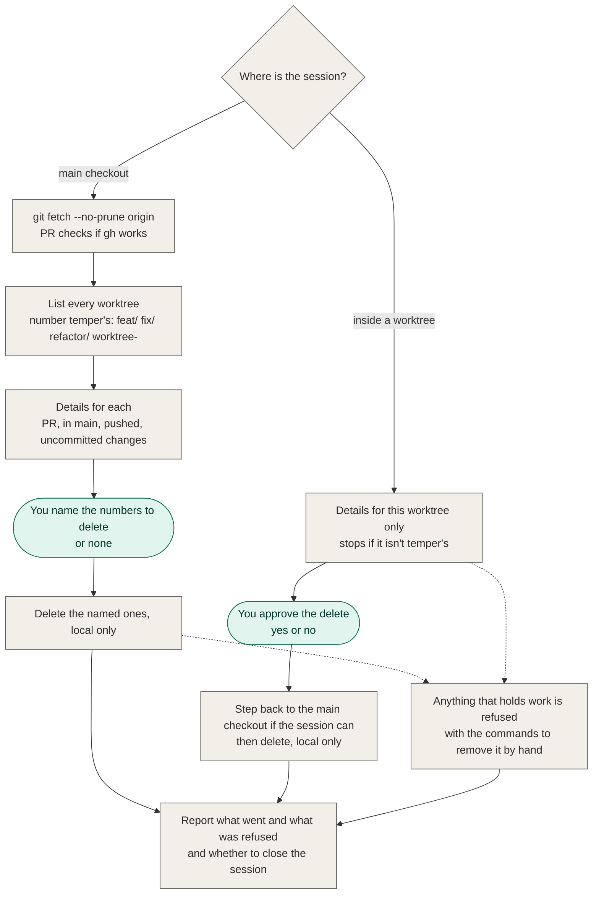

# Clean the Current Worktree Implementation Plan

> **For agentic workers:** REQUIRED SUB-SKILL: Use superpowers:subagent-driven-development (recommended) or superpowers:executing-plans to implement this plan task-by-task. Steps use checkbox (`- [ ]`) syntax for tracking.

**Goal:** `/temper:cleanup` works from inside a worktree: it deletes that one worktree and its local branch, after showing its details and getting approval.

**Architecture:** The cleanup command is one markdown prompt file. Its opening "stop unless in the main checkout" rule becomes a branch between a *full run* (main checkout, today's numbered table) and a *current-worktree run* (one item, one yes/no). Both runs share the same definition of a temper item, the same detail checks, the same "holds work" rule and the same git delete steps; every refusal now prints manual force commands.

**Tech Stack:** Markdown prompt files in a Claude Code plugin; git; `gh`; the harness's `ExitWorktree` tool.

**Spec:** `.scratch/cleanup-current-worktree/spec.md`

## Handing back to temper

This plan runs inside a temper run. When every task is complete and the final
whole-branch review is clean, end with your list of rulings and hand control back
to `/temper:feature`, which checks the branch and opens the pull request. temper's
finish takes the place of `superpowers:finishing-a-development-branch` here.

While it runs, post a progress line as each task starts, as its review comes back,
and as each fix starts, in the shape `build: task <n>/<total> — <what>`.

## Global Constraints

- Work only in this worktree: `/Users/agent-zayaan/Developer/temper/.claude/worktrees/cleanup-current-worktree`, branch `feat/cleanup-current-worktree`. Never `cd` to the main checkout.
- **GateBolt strict mode.** Before editing any file, declare every file the task will touch, or the edit is blocked:
  `gatebolt declare --task "<one line>" --vendor claude_code --name "Claude Code" --model <your-model-id> --file <path> [--file <path> ...]`
- **Gate:** `claude plugin validate .` must pass before every commit.
- **Commits:** subject line only, no body, no trailer (not even Co-Authored-By); lowercase; at most 80 characters; says what changed; one logical change per commit.
- The session's shell refuses compound git commands. Run each git command as its own plain command.
- The command stays local only: no `git push`, no `git fetch --prune`, no `gh pr close`.
- The command itself never runs `--force`. It only prints force commands for the user.
- No new command file. The change extends `commands/cleanup.md`.
- User-facing lines the command prints are short and direct. No padding.
- Settled fact (tested in a throwaway repo on git 2.x, macOS): `git worktree remove` succeeds while the shell's working directory is inside the worktree being removed, both plain and with `git -C <main checkout>`. Afterwards the shell's directory no longer exists and git commands run there fail with "Unable to read current working directory". So the spec's fallback (refuse when git won't allow it) is not needed and is not built.

## Review Focus

1. **The user runs cleanup from a subfolder of the worktree.** The item is still found: the worktree is identified by `git rev-parse --show-toplevel`, not the shell's directory. Pinned by Task 3, scenario 2.
2. **The current worktree is on a detached HEAD, or on a branch without a temper prefix.** Nothing is deleted and the user is told it's theirs to remove by hand. Pinned by Task 3, scenario 6.
3. **`gh` is missing or errors, or the fetch fails.** The PR reads "couldn't check", which counts as holding work: cleanup refuses and prints the manual commands. A failed fetch is reported and the run carries on. Pinned by Task 3, scenario 5.
4. **The approval answer isn't a clear yes** ("ok maybe", "sure, later", a number). Nothing is deleted. Pinned by Task 3, scenario 7.
5. **The main checkout's path contains a space.** Every command still works because paths are single-quoted, and the printed manual commands are single-quoted too. Pinned by Task 3, scenario 8.

---

### Task 1: Rewrite the cleanup command

**Files:**
- Modify: `commands/cleanup.md` (whole file)

**Interfaces:**
- Consumes: nothing.
- Produces: the terms **full run**, **current-worktree run**, **main checkout**, **temper item**, **holds work**, and the **manual commands** block. Task 2 describes these in the README; Task 3 walks them.

- [ ] **Step 1: Declare the file**

Run:
```
gatebolt declare --task "let temper cleanup run from inside a worktree" --vendor claude_code --name "Claude Code" --model <your-model-id> --file commands/cleanup.md
```
Expected: `Declared change <id> (1 file(s)).`

- [ ] **Step 2: Read the current file**

Read `commands/cleanup.md` in full. It has a frontmatter `description` and four sections: `## 1. Look`, `## 2. Details`, `## 3. Ask`, `## 4. Delete`.

- [ ] **Step 3: Replace the file with this content**

````markdown
---
description: "Show every worktree in this project with its PR and merge details, then delete only the temper worktrees and branches you name. Run from inside a temper worktree, it deals with that one alone. Local only: nothing on the remote is touched."
---

# temper cleanup

Deletes temper's leftover worktrees and branches, and only the ones the user
approves. Only temper's items can be deleted: local `feat/`, `fix/`, `refactor/`
or `worktree-` branches and their worktrees under `.claude/worktrees/`. It never
touches the remote: no `git push`, no `git fetch --prune`, no `gh pr close`.
Single-quote every branch and path you put in a command.

## 1. Look

Run `git rev-parse --path-format=absolute --git-dir --git-common-dir`. The
**main checkout** is the folder that holds the second path. If the two paths
match, the session is in the main checkout and this is a **full run**: it shows
every worktree and deletes the ones the user names. If they differ, the session
is inside a worktree and this is a **current-worktree run**: it deals with that
worktree alone.

Run `git fetch --no-prune origin`; if it fails, say so and carry on. Then list
every worktree from `git worktree list --porcelain`, and the temper branches from
`git branch --format='%(refname:short)' --list 'feat/*' 'fix/*' 'refactor/*' 'worktree-*'`.

A **temper item** is one of those branches, with its worktree if one under
`.claude/worktrees/` is on it. Everything else (the main checkout, the default
branch, detached worktrees, other branches, worktrees outside
`.claude/worktrees/`) is shown for information and can't be picked. So is any
branch whose name, or path inside the repo, has a character outside
`A-Za-z0-9._/-`: it isn't a temper item, run no command with its name in it, and
say it's for the user to remove by hand.

In a current-worktree run the only item is the one whose worktree is
`git rev-parse --show-toplevel`. If that worktree isn't a temper item, say it's
for the user to remove by hand, delete nothing, and stop.

Done when you have every worktree and every temper item, or the one item of a
current-worktree run.

## 2. Details

For each temper item, find out:

- **PR**: `gh pr list --head <branch> --state all --json number,state` gives open,
  merged, closed, or none. If any is open, it's open; otherwise the newest decides.
  If `gh` is missing or errors, "couldn't check".
- **main**: `git merge-base --is-ancestor <branch> origin/<default branch>` exits 0
  for "already in main", 1 for "has commits of its own". The default branch is as
  the `start` skill defines it.
- **pushed**: `git rev-list --count <branch> --not --remotes=origin` gives 0 for
  "all pushed", otherwise "N commits only here".
- **worktree**: none; "folder missing" if the porcelain record says `prunable`;
  "locked"; otherwise `git -C <path> status --porcelain --untracked-files=all`
  gives "no changes" or "uncommitted changes". If the branch is checked out
  anywhere else, including the main checkout, "checked out at <path>".

A check that errors, or exits other than as described, reads "couldn't check".

An item **holds work** when it has an open PR, commits only here, uncommitted
changes, a locked worktree, is checked out elsewhere, or has anything that
couldn't be checked.

Done when every temper item has its details.

## 3. Ask

**Full run.** Show one table: a number for each temper item, its worktree (or
`—`), its branch, and its details, marking the ones that hold work. Below it,
list the other worktrees without numbers. Then ask the user which numbers to
delete, or none. Delete nothing they didn't name by number. If the answer isn't
numbers or "none", ask again.

**Current-worktree run.** Show the item's worktree, branch and details. If it
holds work, don't ask: refuse it as step 4 describes, and stop. Otherwise say
what will be deleted — the worktree folder and the local branch, nothing on the
remote — and ask yes or no. Anything other than a clear yes deletes nothing: say
so and stop.

Done when the user has answered, or the item was refused.

## 4. Delete

An item that holds work is never deleted. Say why, then print the commands that
remove it by hand, filled in and single-quoted. Print them; never run them.

```
git -C '<main checkout>' worktree remove --force '<worktree path>'
git -C '<main checkout>' branch -D '<branch>'
```

Leave out the first line when the item has no worktree. For a locked worktree,
put `git -C '<main checkout>' worktree unlock '<worktree path>'` first. When the
branch is checked out elsewhere, print no commands: say which checkout has to
leave the branch first.

**Full run.** For each number named, once each, in order: refuse it if it holds
work. Otherwise run `git worktree remove <path>` if it has a worktree (never
`--force`), then `git branch -D <branch>`. If a step fails, report git's message
and skip the rest of that item.

**Current-worktree run.** The session is standing in the folder it's deleting,
so leave first if it can:

1. Call `ExitWorktree` with the action `keep`. If it moves the session to the
   main checkout, run `git worktree remove <path>` (never `--force`), then
   `git branch -D <branch>`, there.
2. If it reports no worktree session, or the tool isn't there, the session
   can't leave. Run `git -C <main checkout> worktree remove <path>` (never
   `--force`), then `git -C <main checkout> branch -D <branch>`. These are the
   last commands of the run: the session's folder is gone, so run nothing after
   them.

Either way, if a step fails, report git's message and skip the rest.

Report what was deleted, what was refused and why, and any number that didn't
match an item. When the session couldn't leave and its worktree was deleted, end
with this line and nothing after it:

> This session's folder is gone. Close it with `/exit`, then start a new one in `<main checkout>`.

Done when the report is in front of the user.
````

- [ ] **Step 4: Check the spec's rules are all in the file**

Read the file you wrote and confirm each of these is present. Fix the file if one is missing.

1. No "Stop unless … the same path twice" rule remains.
2. A current-worktree run on a non-temper worktree deletes nothing.
3. The current-worktree run never shows the numbered table.
4. Approval is asked before any delete; anything but yes deletes nothing.
5. The manual commands appear under a refusal in both runs, and the file says they are never run.
6. `--force` appears only inside the printed manual commands and in "never `--force`".
7. The "close this session" line is tied to the case where the session couldn't leave.
8. No `git push`, `--prune` or `gh pr close` appears except in the sentence saying they are never used.

- [ ] **Step 5: Run the gate**

Run: `claude plugin validate .`
Expected: validation passes with no errors.

- [ ] **Step 6: Commit**

Run each as its own command:
```
git add commands/cleanup.md
```
```
git commit -m "let temper cleanup delete the worktree it is run from"
```

---

### Task 2: Update the README

**Files:**
- Modify: `README.md` (the five places below; line numbers are as of the branch start and shift as you edit, so match on the text)

**Interfaces:**
- Consumes: Task 1's terms — a full run from the main checkout, a current-worktree run from inside a worktree, the manual commands on refusal, the close-the-session line.
- Produces: nothing later tasks use.

- [ ] **Step 1: Declare the file**

Run:
```
gatebolt declare --task "document running temper cleanup from inside a worktree" --vendor claude_code --name "Claude Code" --model <your-model-id> --file README.md
```

- [ ] **Step 2: "How to use it" (near line 157)**

Replace:
```
**Start every command from the repo's main checkout, on `main`, with a clean
tree** — except `/temper:review`, which runs inside the worktree it's reviewing,
and `/temper:cleanup`, which runs from the main checkout on any branch.
temper creates the worktree and the branch itself.
```
with:
```
**Start every command from the repo's main checkout, on `main`, with a clean
tree** — except `/temper:review`, which runs inside the worktree it's reviewing,
and `/temper:cleanup`, which runs from the main checkout on any branch or from
inside the worktree you want gone. temper creates the worktree and the branch
itself.
```

- [ ] **Step 3: "Clean up after runs" (near line 240)**

Replace the section body — from `From the main checkout:` down to and including the paragraph ending `such as `.env` copies.` — with:

````
From the main checkout, to see everything:

```
/temper:cleanup
```

It shows every worktree in the project. Each local `feat/`, `fix/`, `refactor/`
or `worktree-` branch gets a number and its details: whether its PR is open,
merged or closed, whether it's already in `main`, whether anything exists only
locally, and whether its worktree has uncommitted changes. Other worktrees are
shown without a number, and `main` is never touched. You name the numbers to
delete, or none.

From inside a worktree, the same command deals with that worktree alone. It
shows the same details, says what it will delete, and asks yes or no. If the
session created the worktree, it steps back to the main checkout first and
carries on there. If it didn't, the worktree is deleted from under it, and it
tells you to close the session and start a new one in the main checkout.

Either way it refuses anything that still holds work, says why, and prints the
commands to remove it by hand. It never runs those itself.

It works locally only: remote branches are never deleted or changed, and the
fetch never prunes. Deleting a worktree also deletes the gitignored files in it,
such as `.env` copies.
````

- [ ] **Step 4: "After the pull request" (near line 280)**

Replace:
```
temper never merges. The worktree stays for PR feedback; once the work lands,
`/temper:cleanup` removes it and its branch.
```
with:
```
temper never merges. The worktree stays for PR feedback; once the work lands,
run `/temper:cleanup` from inside it to remove it and its branch.
```

- [ ] **Step 5: The `/temper:cleanup` diagram (near line 505)**

Replace the whole mermaid block under `### `/temper:cleanup`` with:

````

````

- [ ] **Step 6: The uninstall note (near line 317)**

Replace:
```
- **Worktrees and branches runs left behind** — run `/temper:cleanup` before
  uninstalling. It shows each one's PR and merge state, deletes the ones you name,
  and refuses any that still hold work, so you can save what you want first.
```
with:
```
- **Worktrees and branches runs left behind** — run `/temper:cleanup` from the
  main checkout before uninstalling. It shows each one's PR and merge state,
  deletes the ones you name, and refuses any that still hold work, so you can
  save what you want first.
```

- [ ] **Step 7: Check nothing else says cleanup needs the main checkout**

Run: `grep -n -i "cleanup" README.md`
Read each hit. Expected: no remaining line says or implies cleanup only runs from the main checkout, and none says it "stops if inside a worktree". Fix any that does, in the same plain style.

- [ ] **Step 8: Run the gate**

Run: `claude plugin validate .`
Expected: validation passes with no errors.

- [ ] **Step 9: Commit**

```
git add README.md
```
```
git commit -m "document running temper cleanup from inside a worktree"
```

---

### Task 3: Walk the scenarios and record the results

The repo has no automated tests. This task verifies `commands/cleanup.md` by following it, literally and step by step, in throwaway repositories, and recording what happened. You are the command's reader: do exactly what the file says and nothing it doesn't.

**Files:**
- Create: `.scratch/cleanup-current-worktree/verification.md`
- Modify: `commands/cleanup.md` — only if a scenario shows the file is wrong or unclear

**Interfaces:**
- Consumes: `commands/cleanup.md` as Task 1 left it.
- Produces: `verification.md`, which temper's finish step uses for the pull request.

- [ ] **Step 1: Declare the files**

```
gatebolt declare --task "record scenario walk for temper cleanup from inside a worktree" --vendor claude_code --name "Claude Code" --model <your-model-id> --file .scratch/cleanup-current-worktree/verification.md --file commands/cleanup.md
```

- [ ] **Step 2: Write the fixture script**

Create it in your scratchpad directory (not in this repo) as `fixture.sh`. Throwaway repos live under a directory from `mktemp -d`; nothing is created inside this worktree. Because the session's shell refuses compound git commands in this worktree, all fixture work goes through this script, run as `bash <scratchpad>/fixture.sh <root>`.

```bash
#!/bin/bash
# Builds a throwaway project with a local bare "origin" and a fake gh.
# Usage: fixture.sh <root>   — creates <root>/origin.git, <root>/my project, <root>/bin/gh
set -eu
root="$1"
mkdir -p "$root/bin"
git init -q --bare -b main "$root/origin.git"
proj="$root/my project"          # the space is deliberate: Review Focus 5
git init -q -b main "$proj"
cd "$proj"
git commit -q --allow-empty -m init
git remote add origin "$root/origin.git"
git push -q -u origin main
mkdir -p .claude/worktrees
printf '.claude/worktrees/\n' > .gitignore
git add .gitignore
git commit -q -m "ignore worktrees"
git push -q origin main

# merged: pushed, in main, clean
git worktree add -q -b feat/merged .claude/worktrees/merged
git -C .claude/worktrees/merged commit -q --allow-empty -m work
git -C .claude/worktrees/merged push -q -u origin feat/merged
git merge -q --ff-only feat/merged
git push -q origin main
mkdir -p .claude/worktrees/merged/sub/dir

# dirty: pushed, uncommitted change
git worktree add -q -b feat/dirty .claude/worktrees/dirty
git -C .claude/worktrees/dirty push -q -u origin feat/dirty
printf 'x\n' > .claude/worktrees/dirty/new.txt

# unpushed: a commit that exists only here
git worktree add -q -b fix/unpushed .claude/worktrees/unpushed
git -C .claude/worktrees/unpushed commit -q --allow-empty -m local-only

# openpr: pushed, clean; the fake gh says its PR is open
git worktree add -q -b refactor/openpr .claude/worktrees/openpr
git -C .claude/worktrees/openpr push -q -u origin refactor/openpr

# other: not a temper branch
git worktree add -q -b spike .claude/worktrees/other

# detached: no branch
git worktree add -q --detach .claude/worktrees/detached

# fake gh: answers `gh pr list --head <branch> ...`; GH_FAIL=1 makes it error
cat > "$root/bin/gh" <<'EOF'
#!/bin/bash
[ "${GH_FAIL:-}" = 1 ] && { echo "gh: not logged in" >&2; exit 4; }
head=""
while [ $# -gt 0 ]; do [ "$1" = --head ] && head="$2"; shift; done
case "$head" in
  feat/merged)     echo '[{"number":1,"state":"MERGED"}]' ;;
  refactor/openpr) echo '[{"number":2,"state":"OPEN"}]' ;;
  *)               echo '[]' ;;
esac
EOF
chmod +x "$root/bin/gh"
echo "fixture ready: $proj"
```

- [ ] **Step 3: Write the walk helper**

Also in the scratchpad, as `in.sh`. It runs one command from a given folder with the fake `gh` first on `PATH`, standing in for "the session is in this folder":

```bash
#!/bin/bash
# Usage: in.sh <root> <folder> <command...>
root="$1"; shift
cd "$1" || exit 1; shift
PATH="$root/bin:$PATH" "$@"
```

Check both work. Run `mktemp -d`, then `bash <scratchpad>/fixture.sh <that dir>`, then
`bash <scratchpad>/in.sh <root> "<root>/my project" git worktree list`.
Expected: seven worktrees listed — the project, `merged`, `dirty`, `unpushed`, `openpr`, `other`, `detached`.

- [ ] **Step 4: Walk each scenario**

For each scenario, build a fresh fixture in a new `mktemp -d` root, then follow `commands/cleanup.md` from step 1 to the end, running each command it names through `in.sh` from the scenario's folder. Where the file says to ask the user, use the answer the scenario gives. Where it says to call `ExitWorktree`, you can't from a throwaway repo: take the branch the scenario names. After the walk, check the result with `git worktree list` and `git branch --list` from the project folder.

| # | Folder the session is in | Stand-ins | Expected |
|---|---|---|---|
| 1 | `.claude/worktrees/merged` | `ExitWorktree` reports no session; answer "yes" | Details read PR merged, already in main, all pushed, no changes. Both `git -C` commands succeed. Worktree and `feat/merged` gone. The run ends with the close-the-session line naming the project folder. No command is run afterwards. |
| 2 | `.claude/worktrees/merged/sub/dir` | same as 1 | Same result as 1: the item is found from a subfolder. |
| 3 | `.claude/worktrees/merged` | `ExitWorktree` moves the session: run the delete commands from the project folder without `-C`; answer "yes" | Worktree and `feat/merged` gone. No close-the-session line. |
| 4 | `.claude/worktrees/dirty`, then `unpushed`, then `openpr` | none | Each refused without asking, with its reason (uncommitted changes; 1 commit only here; open PR). Manual commands printed, single-quoted, never run. All three worktrees and branches still exist. |
| 5 | `.claude/worktrees/merged` | `GH_FAIL=1` in the environment; also rename `origin` to a path that doesn't exist first so the fetch fails | The failed fetch is reported and the walk carries on. PR reads "couldn't check", so the item holds work: refused, manual commands printed, nothing deleted. |
| 6 | `.claude/worktrees/other`, then `detached` | none | Each: "for the user to remove by hand", nothing deleted, no question asked. |
| 7 | `.claude/worktrees/merged` | answer "ok maybe" | Nothing deleted; the command says so and stops. |
| 8 | the project folder (a full run) | answer with the numbers of `merged` and `dirty` | Table lists four numbered items (`merged`, `dirty`, `unpushed`, `openpr`), with `other`, `detached` and the main checkout unnumbered. `merged` deleted. `dirty` refused with its reason and the manual commands. Every command worked despite the space in the project path. |

For scenario 4, also check the manual commands are right: after recording the refusal, run the printed commands for `dirty` yourself and confirm the worktree and branch are gone. That is you acting as the user, not the command.

A scenario fails when the file's instructions, followed literally, give a different result, or when you had to guess what the file meant.

- [ ] **Step 5: Fix what the walk found**

If a scenario failed, change `commands/cleanup.md` so that following it literally gives the expected result, then walk that scenario again on a fresh fixture. Keep the fix as small as the problem. If every scenario passed, change nothing.

- [ ] **Step 6: Record the results**

Write `.scratch/cleanup-current-worktree/verification.md`:

```markdown
# Verification: cleanup from inside a worktree

Walked by following `commands/cleanup.md` step by step in throwaway repositories
(local bare origin, a stand-in `gh`, a project path with a space in it).
`ExitWorktree` can't be called in a throwaway repo; scenarios 1–2 took its
"no worktree session" branch and scenario 3 its "moved to the main checkout" branch.

git version: <output of `git --version`>

| # | Scenario | Result | Notes |
|---|---|---|---|
| 1 | merged worktree, session can't leave | pass / fail | <what was observed> |
| 2 | same, from a subfolder | | |
| 3 | merged worktree, session steps back | | |
| 4 | holds work: uncommitted, unpushed, open PR | | |
| 5 | `gh` errors and fetch fails | | |
| 6 | not a temper item: other branch, detached | | |
| 7 | approval isn't a clear yes | | |
| 8 | full run from the main checkout | | |

## Changes made to the command

<each fix from step 5 with the scenario that found it, or "None.">

## Not verified

- A live `ExitWorktree` call. Its two outcomes were stood in for, not exercised.
```

Fill every row with what you actually observed. A row you couldn't walk says so and why; it is not marked pass.

- [ ] **Step 7: Run the gate**

Run: `claude plugin validate .`
Expected: validation passes with no errors.

- [ ] **Step 8: Commit**

If step 5 changed the command, commit that first, on its own:
```
git add commands/cleanup.md
```
```
git commit -m "<what the fix changed, lowercase, at most 80 characters>"
```
Then:
```
git add .scratch/cleanup-current-worktree/verification.md
```
```
git commit -m "record scenario walk for cleanup from inside a worktree"
```
