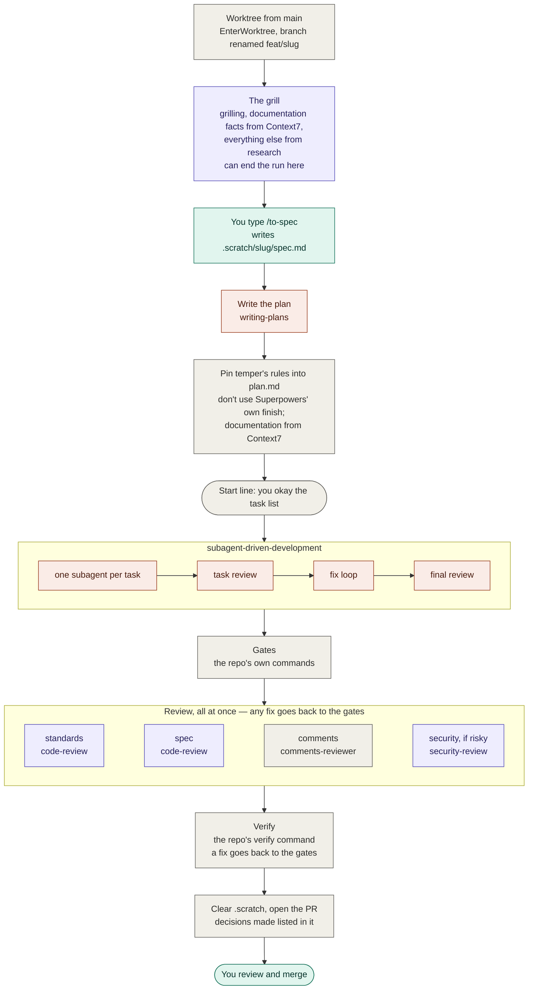
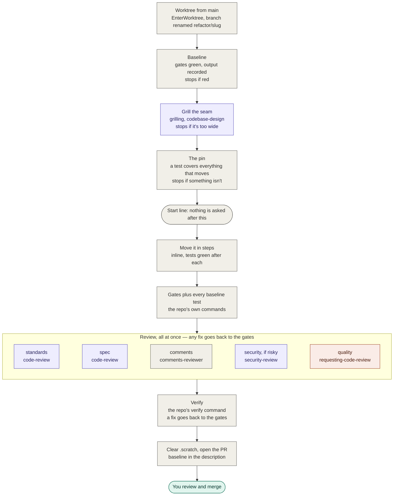
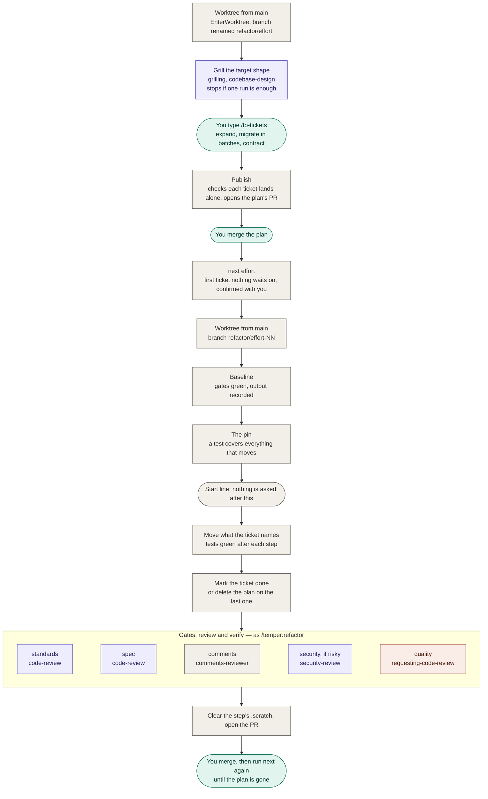

# temper

An agent pipeline that takes rough work to a reviewed pull request.

Tempering is the step that turns hard-but-brittle metal into something tough.
Rough work goes under heat, gets shaped, and has to prove it won't shatter before
it gets out.

## How it's put together

temper writes almost none of the thinking. It sequences skills that already
exist, and owns only what nothing else does: the order, the point after which
nothing is asked, the repo's own gates, and the decision about whether the work
is good enough to propose.

| Part of the job | Comes from | Skills |
|---|---|---|
| Shaping the work | [Matt Pocock's skills](https://github.com/mattpocock/skills) | `grilling`, `research`, `to-spec`, `to-tickets`, `code-review`, `codebase-design` |
| Building it | [Superpowers](https://github.com/obra/superpowers) | `writing-plans`, `subagent-driven-development`, `systematic-debugging`, `requesting-code-review` |
| Isolation and security | Claude Code itself | `EnterWorktree`, `security-review` |
| Gates, documentation, refactor steps, review panel, proposing | temper | `start`, `docs`, `baseline`, `reshape`, `check`, `finish`, and one agent: `comments-reviewer` |

The rule behind every choice: if a skill already does the job, use it. temper
has exactly one agent of its own, because the only existing comments pass
rewrites code instead of reviewing it.

## Requirements

- **Claude Code**, with the [GitHub CLI](https://cli.github.com) signed in, in a
  repo with a GitHub remote.
- **`mattpocock-skills`** and **`superpowers`**, which installing temper brings in.
  temper declares both as dependencies from Anthropic's official marketplace, and
  enabling temper for a repo enables them there too.

If either is missing anyway — turned off by hand, or temper came from a marketplace
that doesn't allow dependencies from other marketplaces — `/temper:setup` stops and
says what to install, because a command that loads a skill which isn't there
improvises the method instead of failing.

**Context7 is preferred for documentation, and temper doesn't ship it.** It is
where a run gets facts that are true today: any question about a library,
framework, SDK, CLI or hosted API is looked up there, pinned to the version the
repo uses, never answered from memory or the web. Install it however you like —
the `context7` plugin, or `npx ctx7 setup --claude` for the CLI and its
`find-docs` skill — and temper uses whichever path it finds. When none is there,
or it can't answer, the run reads that thing's source in the repo instead, records
a ruling naming where the fact came from, and carries on.

**pstack is deliberately not used.** Its session-start hook tells every session,
in every repo, to treat `poteto-mode` as the entry point for all engineering
work — and re-injects that after every compaction, so the longer a temper run
goes, the louder it gets.

## Install

```
/plugin marketplace add junayed711/temper
/plugin install temper@temper
```

That installs `mattpocock-skills` and `superpowers` from `claude-plugins-official`
along with it. Claude Code registers that marketplace the first time it starts
interactively; if it isn't there, add it first with
`/plugin marketplace add anthropics/claude-plugins-official`.

If you already have Matt's skills from his own marketplace, uninstall that copy
first with `/plugin uninstall mattpocock-skills@mattpocock`, so there aren't two
copies of the same skills.

The same commands work from a terminal as `claude plugin …`. Start a new session
afterwards; a running session doesn't pick up new skills.

### From a clone

If you've cloned the repo — because temper isn't in a marketplace yet, or because
you're working on it — there are two ways to run it.

**Install it from the clone.** It stays installed, and its dependencies install with
it:

```
claude plugin marketplace add /path/to/temper
claude plugin install temper@temper
```

The clone acts as the marketplace, so it installs whichever branch is checked out —
usually `main`. If you've already added temper's marketplace from GitHub, remove it
first with `claude plugin marketplace remove temper`, since both are named `temper`.

Installing takes a copy, so later changes in the clone don't reach it on their own.
After a `git pull`, bring them in with:

```
claude plugin marketplace update temper
claude plugin update temper@temper
```

That only takes effect when the pull changed the version in
`.claude-plugin/plugin.json` — the same version counts as up to date. Restart the
session afterwards.

**Load it for one session.** Nothing is installed, and changes in the clone apply as
you make them: run `/reload-plugins` to pick them up.

```
claude --plugin-dir /path/to/temper
```

Use this while changing temper itself. It doesn't install dependencies, so Matt's
skills and Superpowers need to be installed already:

```
claude plugin install mattpocock-skills@claude-plugins-official
claude plugin install superpowers@claude-plugins-official
```

If temper is also installed, the copy loaded this way takes precedence for that
session.

### Keep it to the repos that use it

Superpowers adds its own instructions to every session, in every repo where it's
enabled. To keep it — and temper — to the repos you choose, turn both off
everywhere, then on per repo. The order matters: a plugin can't be turned off while
a plugin that depends on it is still on.

```
claude plugin disable temper@temper --scope user
claude plugin disable superpowers@claude-plugins-official --scope user
```

Then, in each repo that uses temper:

```
claude plugin enable temper@temper --scope project
```

That turns on its dependencies for the repo as well, and writes them to the repo's
`.claude/settings.json` — commit it.

## Set up a repo

Once per repo, from its main checkout, run **`/temper:setup`**. It checks the
skills are installed and that `.scratch/` isn't gitignored. Then it proposes
`.claude/temper.md` and writes it once you agree:

```markdown
# temper

- Gates: pnpm typecheck; pnpm lint; pnpm test
- Risky paths: packages/auth/** (the ledger skill); packages/db/drizzle/** (none)
- Verify: pnpm test:live
- Commits: lowercase subject only, at most 80 characters
```

Commit it, so every worktree has it. temper keeps its settings in its own file, so
the repo's `CLAUDE.md` never has to mention a workflow. There's no need to run
`/setup-matt-pocock-skills`: each run tells Matt's skills to write to `.scratch/`.

Gates, Verify and Commits each take `none` rather than being left empty, so a
repo with no gates says so instead of silently passing. Run it again whenever
those change; it shows what it would change rather than overwriting.

## How to use it

**Start every command from the repo's main checkout, on `main`, with a clean
tree** — except `/temper:review`, which runs inside the worktree it's reviewing.
temper creates the worktree and the branch itself.

### Build something new

```
/temper:feature add CSV export to the audit page
```

1. Confirm the name it proposes. That becomes the worktree, the branch
   (`feat/csv-audit-export`) and the `.scratch/` folder.
2. Answer the grill. It asks in rounds, each question with a recommended answer
   you can accept in a word, and looks facts up itself rather than asking you.
   It can also conclude the work shouldn't happen, and end the run there.
3. When it stops, type **`/to-spec`**. Matt's skill writes the spec to
   `.scratch/<slug>/spec.md` and asks you to confirm where the tests will sit.
4. Type **`/temper:feature build`**.
5. Look over the task list and say go. **That's the last thing you'll be asked.**
6. Come back to a pull request, or a report of why there isn't one.

### Fix a bug

```
/temper:bug the drift score inverts on renames
```

Four questions — the symptom, what should happen, how to reach it, what's out —
then nothing more. It finds the root cause, fixes it test-first, checks it and
opens the PR. If three fixes in a row fail, it stops: that's a design problem,
not a bug, and it says so.

### Reshape code without changing what it does

```
/temper:refactor pull the scoring rules out of reconcile.ts
```

It checks first that the tests pass, then grills you about the seam. Before
anything moves, it confirms the tests actually cover the code that's moving — a
green suite over untested code proves nothing. Then it moves the code in small
steps with the tests green after each.
**Narrow refactors only**: if the grill finds the change fans out across the
codebase, the run stops and points you to `/temper:overhaul`.

### Reshape code across the codebase

```
/temper:overhaul split the api package into per-surface packages
```

A refactor too wide for one pull request becomes a plan of small ones.

1. Confirm the name it proposes — the **effort**. Keep it short; every step is
   named after it.
2. Answer the grill: the target shape, the seams, and which callers move in which
   batches.
3. Type **`/to-tickets`**. Matt's skill proposes the steps — add the new shape
   beside the old, move callers across in batches, delete the old — and you agree
   the breakdown.
4. Type **`/temper:overhaul publish`**. It opens a pull request with just the plan,
   in `.scratch/<effort>/issues/`. Merge it.
5. From the main checkout, type **`/temper:overhaul next <effort>`**. It picks the
   first ticket nothing is waiting on, confirms it with you, and runs it as a
   narrow refactor: baseline, pin, move, check, pull request. The pull request
   marks the ticket done.
6. Merge, pull, and run `next` again. The last ticket's pull request deletes the
   plan.

### Review work that already exists

From inside the worktree you want reviewed:

```
/temper:review
```

It reviews against `main` by default, or pass a commit, branch or tag. It uses
the branch's spec if temper built it, otherwise it asks you one line about what
the change should do. It reports a verdict and changes nothing — no fixes, no
commits, no PR.

### The start line

Each command asks everything up front and then stops asking. After that point a
run never waits on you: when it hits a judgement call it decides, records the
decision, and carries on. Every decision it made on your behalf is listed in the
pull request.

### When a run stops

Everything stays: the worktree, the branch, every commit, and `.scratch/`. The
report says what stopped it and where it got to.

- **A feature** resumes from where it stopped — run `/temper:feature build`
  again in the same worktree. Superpowers keeps a ledger of finished tasks.
- **A bug or refactor** has no resume; the report tells you what's done.
- **An overhaul step** has no resume either, but the plan is untouched: the
  ticket stays open until a pull request that marks it done is merged.

### After the pull request

temper never merges. The worktree stays for PR feedback; remove it yourself once
the work lands.

## Uninstall

### Remove the plugin

```
claude plugin uninstall temper@temper --prune
```

`--prune` also removes Matt's skills and Superpowers, but only the copies temper
installed for you — a copy you installed yourself stays. Leave `--prune` off to keep
both. Add `-y` when running it from a script.

Uninstalling always happens user-wide: `--scope project` is refused, because
enabling temper for a repo doesn't install it there.

Then remove the marketplace, and start a new session:

```
claude plugin marketplace remove temper
```

### Clean up each repo that used it

Uninstalling leaves every repo's own files as they were. In each one:

- **`.claude/settings.json`** — delete `temper@temper`,
  `mattpocock-skills@claude-plugins-official` and
  `superpowers@claude-plugins-official` from `enabledPlugins`, then commit. They
  stay listed after an uninstall.
- **`.claude/temper.md`** — delete it, then commit.
- **An overhaul that didn't finish** — its plan is still committed in
  `.scratch/<effort>/`. Delete the folder, then commit.
- **Runs that didn't finish** — `git worktree list` shows any left under
  `.claude/worktrees/`, each on a `feat/`, `fix/` or `refactor/` branch holding its
  `.scratch/` folder. Once you've saved anything you want from one, remove it with
  `git worktree remove .claude/worktrees/<slug>`, then delete its branch.
- **`.superpowers/`** — a build that stopped partway through can leave its
  workspace here. It's gitignored, so delete the folder.

## Workflows

Purple is Matt's skills or Claude Code's own, orange is Superpowers, green is
you, grey is temper. Where a step can end the run or send work back, its box says so.

### `/temper:feature`



### `/temper:bug`


### `/temper:refactor`



### `/temper:overhaul`

Planned once, then one ticket per pull request until the plan is gone.



### `/temper:review`


### Side by side

| | `/feature` | `/bug` | `/refactor` | `/overhaul` | `/review` |
|---|---|---|---|---|---|
| Branch | `feat/<slug>` | `fix/<slug>` | `refactor/<slug>` | `refactor/<effort>`, then `refactor/<effort>-<NN>` | the one you're in |
| You type a command | `/to-spec` | — | — | `/to-tickets` | — |
| Last question | okay the task list | end of the grill | end of the grill | run this ticket? | the intent |
| Built by | Superpowers' build loop | `systematic-debugging` | temper, inline | temper, inline, a ticket at a time | nothing |
| Review seats | 4 | 5 | 5 | 5 per ticket | 5 |
| Fixes return to the gates | yes | yes | yes | yes | no |
| Ends in | a pull request | a pull request | a pull request | a plan PR, then one PR per ticket | a verdict |

`/feature` has four review seats rather than five because Superpowers' build loop
already ran the quality review on the whole branch.

## The shared ending

Every command except `/review` finishes with the same two skills.

### `check`

1. **Gates.** Commit first, then run the repo's gate commands, recording the
   commit and each command's output. A red gate stops the run.
2. **The review panel, all at once.** Standards and spec from `code-review`,
   given the spec's path; comments from `comments-reviewer`, which follows the
   repo's own comment rules; security from `security-review`, only when the
   branch touches a risky path; quality from `requesting-code-review` when
   Superpowers hasn't already run it.
3. **Fixes.** One fix agent receives every finding. Then back to the gates, and
   only the fixed findings are checked again. Two rounds on the same finding
   stops the run — a fix that needs fixing is bigger than a fix.
4. **Verify** with the repo's own command: pass, fail, or inconclusive.
5. **Decide.** Clean means the commit still matches the last gate run, the tree
   is clean, every gate passed, nothing in the spec is missing, no documented
   rule is broken, security found nothing above Low, and verify didn't fail.

The security pass reports one of three outcomes: ran and clean, ran with
findings, or **not run** — with the reason. A review that found nothing to look
at counts as not run, never as clean. Not run on a risky path doesn't block the
pull request, but it's the first thing under Heads up in the description.

In `/review`, `check` never fixes anything and never loops.

### `finish`

Only when `check` comes out clean:

1. Write the description while `.scratch/` still exists. It opens with a plain
   summary: one sentence, what changes, and a Heads up for anything not checked
   or risky if wrong. The full record (the spec in brief, every decision
   Superpowers made on your behalf, how it was checked, findings that didn't
   block) sits in a collapsed Details section below. Your own or the repo's pull
   request rules win over this layout.
2. Delete `.scratch/<slug>/` and commit.
3. Run the gates again, because that deletion is a change.
4. Push the branch and open the pull request.

It never merges.

## Where things live

| What | Where | Lifetime |
|---|---|---|
| Worktree | `.claude/worktrees/<slug>` | until you remove it |
| Branch | `feat/`, `fix/` or `refactor/` + slug | until merged |
| Spec, plan, research notes, baseline | `.scratch/<slug>/` | committed on the branch, deleted before the PR |
| Build ledger | `.superpowers/sdd/<plan>/` | Superpowers' own, gitignored, deleted when its build finishes |
| Overhaul plan | `.scratch/<effort>/issues/` | committed on the default branch, deleted by the last ticket's PR |
| Repo config | `.claude/temper.md` | permanent |

## Design decisions

- **Matt shapes, Superpowers builds.** Matt's grill and spec are the best thing
  available for deciding *what*; Superpowers' build loop — fresh agent per task,
  review after each, a ledger that survives a long session — is the best for
  *how*. temper doesn't rewrite either.
- **Features use `writing-plans`, not `/to-tickets`.** Superpowers' build loop
  reads one plan file, not a folder of tickets. `/to-tickets` is used only by
  `/temper:overhaul`, where each ticket becomes its own pull request.
- **Specs and plans are deleted before the PR.** Documents left in the repo get
  trusted long after they stop being true. The pull request carries what needs
  to last, attached to the change it explains.
- **Every run gets a worktree from `main`, with a branch named for the work.**
  Claude Code names worktree branches `worktree-<name>`; temper renames them.
- **Nothing is asked after the start line.** A run that waits on you costs your
  whole day; a wrong decision recorded in the PR costs a review comment.
- **Fixes go back through the gates.** A fix is a new commit, so the gates you
  ran no longer describe what would be pushed.
- **A refactor never goes through `writing-plans`.** It makes every task a failing
  test first, and a refactor's steps add no tests — their proof is the baseline
  staying green. So temper moves the code itself, one narrow run at a time.
- **A wide refactor is a series of narrow ones.** `/temper:overhaul` plans it with
  `/to-tickets` as expand, migrate in batches, contract, and runs each ticket as its
  own pull request. Every merge leaves the default branch working, the reviews stay
  small, and the work can pause between any two tickets.
- **An overhaul's plan is committed while it runs.** Every step starts from the
  default branch, so the plan has to be there. It's the one document temper leaves
  in the repo past a pull request, and the last ticket's pull request deletes it.
- **One task at a time.** Parallel builds need integration and conflict handling
  that nothing yet has justified.
- **Nothing in `CLAUDE.md`.** A repo's instructions describe the repo, not the
  workflow used on it. temper's settings live in `.claude/temper.md`, and each
  command carries its own rules. The cost: those rules aren't always loaded the
  way `CLAUDE.md` is.
- **temper carries its own documentation rule.** Context7's own setup writes a
  user-level rule, which reaches a session but not a subagent that session
  dispatches — and a temper build is subagents. So `temper:docs` states the rule,
  and temper pins it into the plan's Global Constraints, the one part of a plan
  the build loop hands every implementer, and into the ticket a reshape reads. It
  adds what the vendor's rule doesn't say: pin the lookup to the repo's version,
  and record where a fact came from when Context7 couldn't answer it.
- **No pstack.** See Requirements.

### Living alongside Superpowers

Superpowers reinjects its own rules at the start of every session and after
every compaction, and its build loop ends by handing off to its own finish —
which asks you whether to merge, open a PR or keep the branch. temper guards
that hand-off three ways: `/temper:feature` tells the build loop to hand back;
temper pins the same rule into the plan file, which the build loop's ledger points
a recovering session back to; and Superpowers is enabled only in repos that use
temper.

## Not yet proven

Everything above has been designed and checked against the skills' source, but
not run. These can only be settled by a real run:

1. Superpowers hands back to temper at the end of its build loop, with the rule
   in the command and the plan rather than in `CLAUDE.md`.
2. The rule pinned in `plan.md` still holds after a long session compacts.
3. `security-review` reviews a committed range rather than only uncommitted work.
4. Enabling temper per repo keeps Superpowers' session instructions out of other
   repos. Per-repo enabling of a plugin and its dependencies was tested with
   stand-in plugins; Superpowers' own hook wasn't.
5. `EnterWorktree` works when called from inside a plugin command.
6. `/to-tickets` writes to `.scratch/<effort>/issues/` when told so in the
   conversation, without `/setup-matt-pocock-skills` having configured a tracker.
7. The build loop copies the documentation line from the plan's Global
   Constraints into every implementer's dispatch, including after a long session
   compacts.

## Not supported

- **Parallel builds.** One task at a time.
- **Refactors that can't land in green steps.** A wide change whose batches only
  pass together, on a shared integration branch.
- **GitHub or GitLab issue trackers.** Four things depend on local markdown:
  where tickets live, how status is recorded, how `code-review` finds the spec,
  and what gets deleted before the PR.
- **Chores.** A docs or config change doesn't need a pipeline.

## Files

```
temper/
├── .claude-plugin/          plugin and marketplace manifests
├── commands/
│   ├── setup.md
│   ├── feature.md
│   ├── bug.md
│   ├── refactor.md
│   ├── overhaul.md
│   └── review.md
├── skills/
│   ├── start/               worktree from main, branch named for the work
│   ├── docs/                the documentation rule: Context7, pinned by version
│   ├── baseline/            a refactor's before: the gates, caching off
│   ├── reshape/             the pin, then the move in green steps
│   ├── check/               gates, review panel, fixes, verify, the decision
│   └── finish/              clear .scratch, gate again, open the PR
└── agents/
    └── comments-reviewer.md
```
