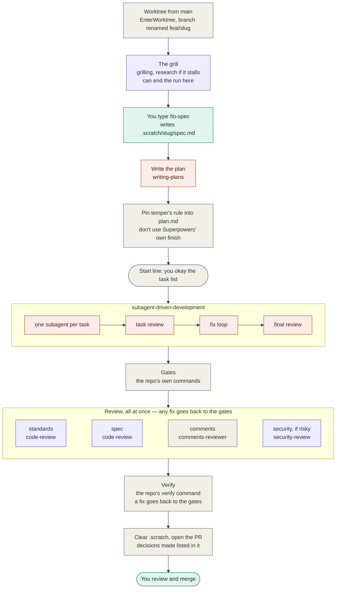
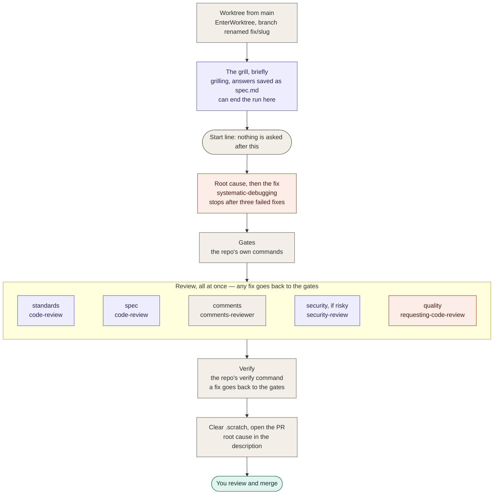
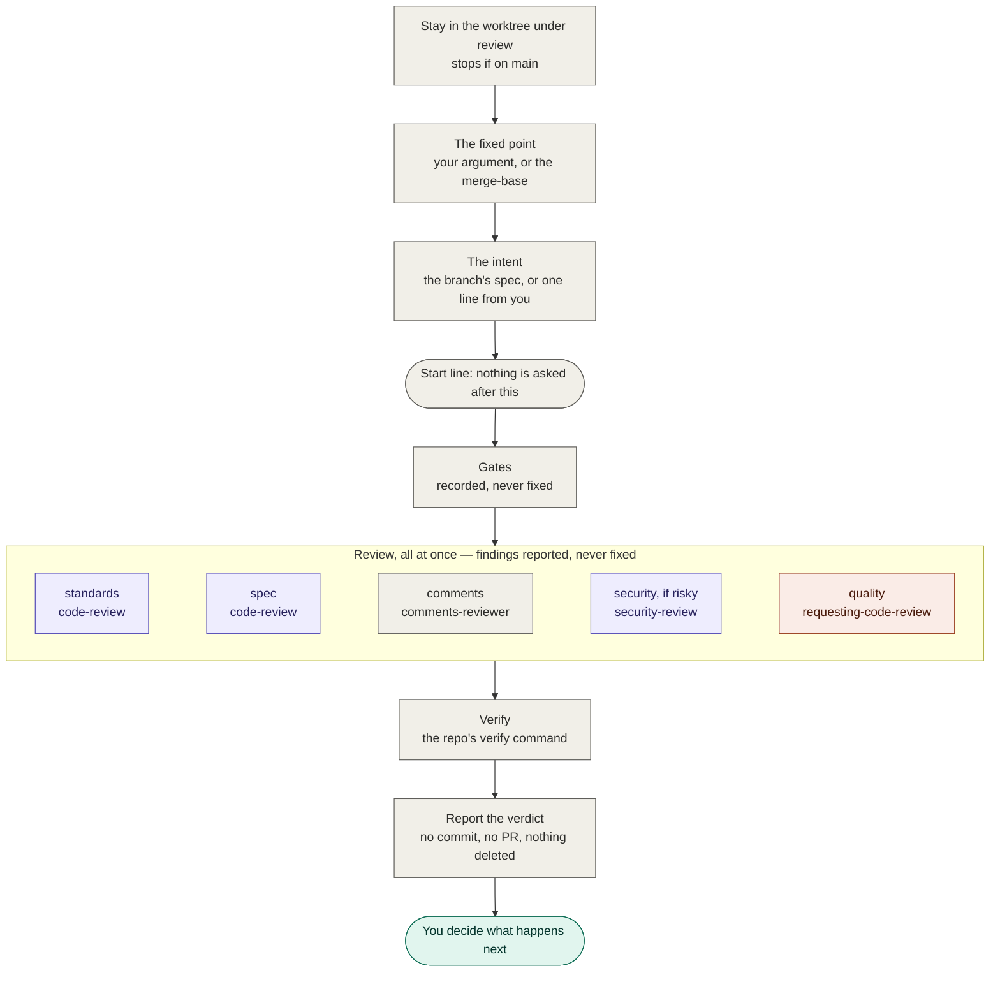

# temper

An agent pipeline that takes rough work to a reviewed pull request.

Tempering is the step that turns hard-but-brittle metal into something tough.
Rough work goes under heat, gets shaped, and has to prove it won't shatter before
it gets out.

## How it's put together

temper writes almost none of the thinking. It sequences skills that already
exist, and owns only what nothing else does: the order, the point after which
nothing is asked, the repo's own gates, and the decision about whether the work
is good enough to propose.

| Part of the job | Comes from | Skills |
|---|---|---|
| Shaping the work | [Matt Pocock's skills](https://github.com/mattpocock/skills) | `grilling`, `research`, `to-spec`, `code-review`, `codebase-design` |
| Building it | [Superpowers](https://github.com/obra/superpowers) | `writing-plans`, `subagent-driven-development`, `systematic-debugging`, `requesting-code-review` |
| Isolation and security | Claude Code itself | `EnterWorktree`, `security-review` |
| Gates, review panel, proposing | temper | `start`, `check`, `finish`, and one agent: `comments-reviewer` |

The rule behind every choice: if a skill already does the job, use it. temper
has exactly one agent of its own, because the only existing comments pass
rewrites code instead of reviewing it.

## Requirements

- **Claude Code**, with the [GitHub CLI](https://cli.github.com) signed in, in a
  repo with a GitHub remote.
- **`mattpocock-skills`**.
- **`superpowers`**. Enable it in the repos that use temper rather than
  everywhere — it injects its own instructions at the start of every session,
  in every repo.

A Claude Code plugin can't declare a dependency on another plugin, so nothing
installs these for you. `/temper:setup` checks for them and stops if any are
missing, because a command that loads a skill which isn't there improvises the
method instead of failing.

**pstack is deliberately not used.** Its session-start hook tells every session,
in every repo, to treat `poteto-mode` as the entry point for all engineering
work — and re-injects that after every compaction, so the longer a temper run
goes, the louder it gets.

## Install

```
/plugin marketplace add mattpocock/skills
/plugin install mattpocock-skills@mattpocock
/plugin install superpowers@claude-plugins-official
/plugin marketplace add junayed711/temper
/plugin install temper@temper
```

The same commands work from a terminal as `claude plugin …`. To install from a
local clone instead, pass its path to `marketplace add`. Start a new session
afterwards; a running session doesn't pick up new skills.

## Set up a repo

Once per repo, from its main checkout:

1. **`/setup-matt-pocock-skills`** — and choose **Local markdown** as the issue
   tracker. temper keeps its specs and plans in `.scratch/`, so it won't work
   with GitHub issues.
2. **`/temper:setup`** — checks the skills are installed, that the tracker is
   local markdown, and that `.scratch/` isn't gitignored. Then it proposes a
   `## temper` section for the repo's `CLAUDE.md` and writes it once you agree:

```markdown
## temper

- Worktrees: all work happens in a worktree created from main.
- Superpowers: in temper runs, grilling and /to-spec replace brainstorming,
  and temper's finish replaces finishing-a-development-branch.
- Gates: pnpm typecheck; pnpm lint; pnpm test
- Risky paths: packages/auth/** (the ledger skill); packages/db/drizzle/** (none)
- Verify: pnpm test:live
- Commits: lowercase subject only, at most 80 characters
```

Gates, Verify and Commits each take `none` rather than being left empty, so a
repo with no gates says so instead of silently passing. Run it again whenever
those change; it shows what it would change rather than overwriting.

## How to use it

**Start every command from the repo's main checkout, on `main`, with a clean
tree** — except `/temper:review`, which runs inside the worktree it's reviewing.
temper creates the worktree and the branch itself.

### Build something new

```
/temper:feature add CSV export to the audit page
```

1. Confirm the name it proposes. That becomes the worktree, the branch
   (`feat/csv-audit-export`) and the `.scratch/` folder.
2. Answer the grill. It asks in rounds, each question with a recommended answer
   you can accept in a word, and looks facts up itself rather than asking you.
   It can also conclude the work shouldn't happen, and end the run there.
3. When it stops, type **`/to-spec`**. Matt's skill writes the spec to
   `.scratch/<slug>/spec.md` and asks you to confirm where the tests will sit.
4. Type **`/temper:feature build`**.
5. Look over the task list and say go. **That's the last thing you'll be asked.**
6. Come back to a pull request, or a report of why there isn't one.

### Fix a bug

```
/temper:bug the drift score inverts on renames
```

Four questions — the symptom, what should happen, how to reach it, what's out —
then nothing more. It finds the root cause, fixes it test-first, checks it and
opens the PR. If three fixes in a row fail, it stops: that's a design problem,
not a bug, and it says so.

### Reshape code without changing what it does

```
/temper:refactor pull the scoring rules out of reconcile.ts
```

It checks first that the tests pass, then grills you about the seam. Before
anything moves, it confirms the tests actually cover the code that's moving — a
green suite over untested code proves nothing. Then it moves the code in small
steps with the tests green after each.
**Narrow refactors only**: if the grill finds the change fans out across the
codebase, the run stops and says so.

### Review work that already exists

From inside the worktree you want reviewed:

```
/temper:review
```

It reviews against `main` by default, or pass a commit, branch or tag. It uses
the branch's spec if temper built it, otherwise it asks you one line about what
the change should do. It reports a verdict and changes nothing — no fixes, no
commits, no PR.

### The start line

Each command asks everything up front and then stops asking. After that point a
run never waits on you: when it hits a judgement call it decides, records the
decision, and carries on. Every decision it made on your behalf is listed in the
pull request.

### When a run stops

Everything stays: the worktree, the branch, every commit, and `.scratch/`. The
report says what stopped it and where it got to.

- **A feature** resumes from where it stopped — run `/temper:feature build`
  again in the same worktree. Superpowers keeps a ledger of finished tasks.
- **A bug or refactor** has no resume; the report tells you what's done.

### After the pull request

temper never merges. The worktree stays for PR feedback; remove it yourself once
the work lands.

## Workflows

Purple is Matt's skills or Claude Code's own, orange is Superpowers, green is
you, grey is temper. Where a step can end the run or send work back, its box says so.

### `/temper:feature`



### `/temper:bug`



### `/temper:refactor`


### `/temper:review`



### Side by side

| | `/feature` | `/bug` | `/refactor` | `/review` |
|---|---|---|---|---|
| Branch | `feat/<slug>` | `fix/<slug>` | `refactor/<slug>` | the one you're in |
| You type a command | `/to-spec` | — | — | — |
| Last question | okay the task list | end of the grill | end of the grill | the intent |
| Built by | Superpowers' build loop | `systematic-debugging` | temper, inline | nothing |
| Review seats | 4 | 5 | 5 | 5 |
| Fixes return to the gates | yes | yes | yes | no |
| Ends in | a pull request | a pull request | a pull request | a verdict |

`/feature` has four review seats rather than five because Superpowers' build loop
already ran the quality review on the whole branch.

## The shared ending

Every command except `/review` finishes with the same two skills.

### `check`

1. **Gates.** Commit first, then run the repo's gate commands, recording the
   commit and each command's output. A red gate stops the run.
2. **The review panel, all at once.** Standards and spec from `code-review`,
   given the spec's path; comments from `comments-reviewer`, which follows the
   repo's own comment rules; security from `security-review`, only when the
   branch touches a risky path; quality from `requesting-code-review` when
   Superpowers hasn't already run it.
3. **Fixes.** One fix agent receives every finding. Then back to the gates, and
   only the fixed findings are checked again. Two rounds on the same finding
   stops the run — a fix that needs fixing is bigger than a fix.
4. **Verify** with the repo's own command: pass, fail, or inconclusive.
5. **Decide.** Clean means the commit still matches the last gate run, the tree
   is clean, every gate passed, nothing in the spec is missing, no documented
   rule is broken, security found nothing above Low, and verify didn't fail.

The security pass reports one of three outcomes: ran and clean, ran with
findings, or **not run** — with the reason. A review that found nothing to look
at counts as not run, never as clean. Not run on a risky path doesn't block the
pull request, but it leads the description.

In `/review`, `check` never fixes anything and never loops.

### `finish`

Only when `check` comes out clean:

1. Gather what has to outlive the run: the spec in brief, every decision
   Superpowers made on your behalf, findings that didn't block, and anything
   that wasn't checked.
2. Delete `.scratch/<slug>/` and commit.
3. Run the gates again, because that deletion is a change.
4. Push the branch and open the pull request, titled by the repo's commit rules.

It never merges.

## Where things live

| What | Where | Lifetime |
|---|---|---|
| Worktree | `.claude/worktrees/<slug>` | until you remove it |
| Branch | `feat/`, `fix/` or `refactor/` + slug | until merged |
| Spec, plan, research notes, baseline | `.scratch/<slug>/` | committed on the branch, deleted before the PR |
| Build ledger | `.superpowers/sdd/<plan>/` | Superpowers' own, gitignored, deleted when its build finishes |
| Repo config | the `## temper` section of `CLAUDE.md` | permanent |

## Design decisions

- **Matt shapes, Superpowers builds.** Matt's grill and spec are the best thing
  available for deciding *what*; Superpowers' build loop — fresh agent per task,
  review after each, a ledger that survives a long session — is the best for
  *how*. temper doesn't rewrite either.
- **`/to-tickets` was replaced by `writing-plans`.** Superpowers' build loop reads
  one plan file, not a folder of tickets. It also leaves `/to-spec` as the only
  command you have to type.
- **Specs and plans are deleted before the PR.** Documents left in the repo get
  trusted long after they stop being true. The pull request carries what needs
  to last, attached to the change it explains.
- **Every run gets a worktree from `main`, with a branch named for the work.**
  Claude Code names worktree branches `worktree-<name>`; temper renames them.
- **Nothing is asked after the start line.** A run that waits on you costs your
  whole day; a wrong decision recorded in the PR costs a review comment.
- **Fixes go back through the gates.** A fix is a new commit, so the gates you
  ran no longer describe what would be pushed.
- **Refactors are narrow only.** `writing-plans` makes every task a failing test
  first, and a refactor's middle steps add no tests — their proof is the baseline
  staying green. Wide refactors are rare enough to do by hand.
- **One task at a time.** Parallel builds need integration and conflict handling
  that nothing yet has justified.
- **No pstack.** See Requirements.

### Living alongside Superpowers

Superpowers reinjects its own rules at the start of every session and after
every compaction, and its build loop ends by handing off to its own finish —
which asks you whether to merge, open a PR or keep the branch. temper guards
that hand-off three ways: the override lives in `CLAUDE.md`, which is always
loaded; temper pins the same rule into the plan file, which the build loop
rereads after compaction; and Superpowers is enabled only in repos that use
temper.

## Not yet proven

Everything above has been designed and checked against the skills' source, but
not run. These can only be settled by a real run:

1. Superpowers respects the `CLAUDE.md` override at the end of its build loop.
2. The rule pinned in `plan.md` still holds after a long session compacts.
3. `security-review` reviews a committed range rather than only uncommitted work.
4. Enabling Superpowers per project behaves as expected.
5. `EnterWorktree` works when called from inside a plugin command.

## Not supported

- **Parallel builds.** One task at a time.
- **Wide refactors.** Changes that fan out across the codebase.
- **GitHub or GitLab issue trackers.** Four things depend on local markdown:
  where tickets live, how status is recorded, how `code-review` finds the spec,
  and what gets deleted before the PR.
- **Chores.** A docs or config change doesn't need a pipeline.

## Files

```
temper/
├── .claude-plugin/          plugin and marketplace manifests
├── commands/
│   ├── setup.md
│   ├── feature.md
│   ├── bug.md
│   ├── refactor.md
│   └── review.md
├── skills/
│   ├── start/               worktree from main, branch named for the work
│   ├── check/               gates, review panel, fixes, verify, the decision
│   └── finish/              clear .scratch, gate again, open the PR
└── agents/
    └── comments-reviewer.md
```
